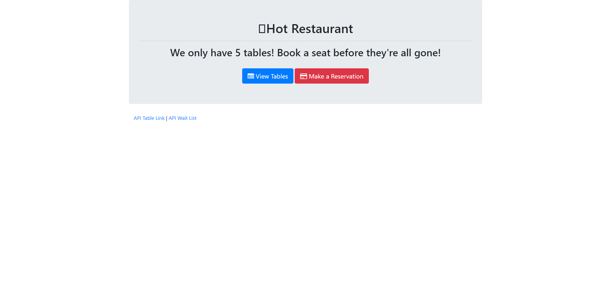

# hot_restaurant
    

    
[](https://github.com/chrisjmckeown/hot_restaurant/blob/master/LICENSE)[](https://GitHub.com/chrisjmckeown/hot_restaurant/graphs/contributors/)[](https://GitHub.com/chrisjmckeown/hot_restaurant/pull/)
    
## Description
Simple app to book tables.
    
## Table of Contents
* [Installation](#Installation)
* [Usage](#Usage)
* [License](#License)
* [Contributing](#Contributing)
* [Tests](#Tests)
* [Questions](#Questions)

## Installation
1. Download and install [Node.js](http://nodejs.org/) (that will install npm as well)
2. Clone this repo
3. Install the dependancies.<br />
    ```
    npm install express
    ```
4. You are done for the setup, run the server using 
    ```
    npm run server.js
    ```  

### Technologies Utilized


"Remove unwanted badges"
   

## Usage
Once installed:
* Create a new booking and see if you get put a reservation or put on a waiting list.


 

### Heroku Deployment

View the deployed app here: https://floating-shelf-09890.herokuapp.com/

## License
 
[](https://github.com/chrisjmckeown/hot_restaurant/blob/master/LICENSE)

## Contributing
Pull requests are welcome. For major changes, please open an issue first to discuss what you would like to change.  

[](code_of_conduct.md)

## Tests
Use <a href="https://www.postman.com/downloads/" target="_blank">Postman</a> to test these end points:
* Get all reserved tables:- http://localhost:5000/api/reserve
* Get all waiting:- http://localhost:5000/api/waiting
* Post:- http://localhost:5000/pi/reserve

## Questions
    
* Follow me at: <a href="https://github.com/chrisjmckeown" target="_blank">https://github.com/chrisjmckeown</a>
    
* Please email with any question at: chris.j.mckeown@hotmail.com
    
© 2020 chrisjmckeown